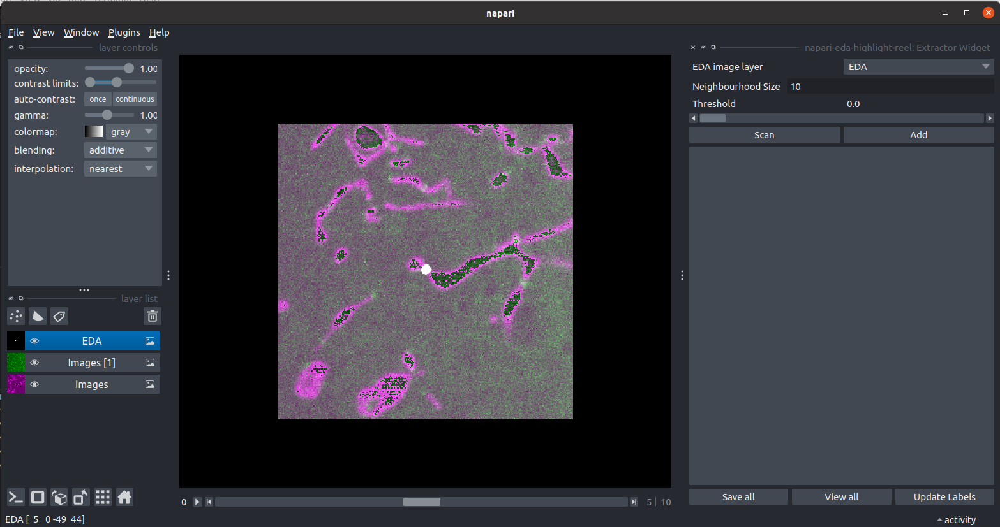
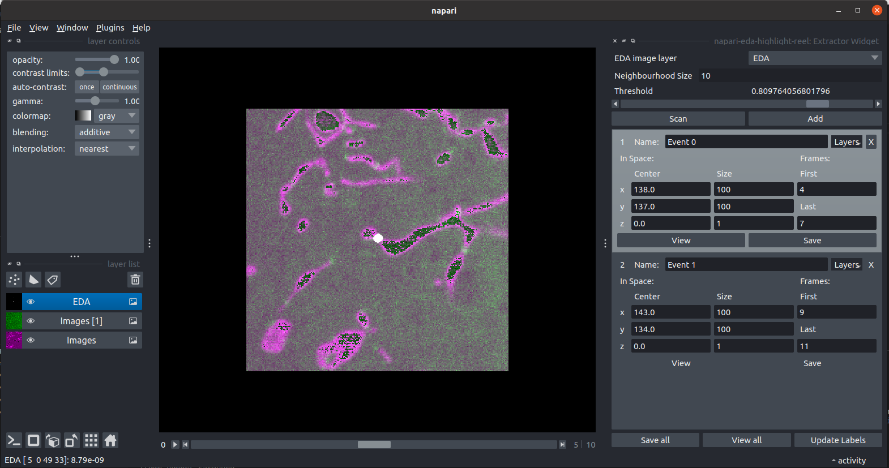
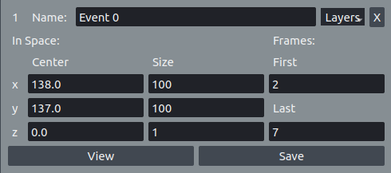

# napari-eda-highlight-reel

This plugin extract the sequences with the highest event scores

----------------------------------

This [napari] plugin was generated with [Cookiecutter] using [@napari]'s [cookiecutter-napari-plugin] template.

<!--
Don't miss the full getting started guide to set up your new package:
https://github.com/napari/cookiecutter-napari-plugin#getting-started

and review the napari docs for plugin developers:
https://napari.org/stable/plugins/index.html
-->

## Installation

You can install `napari-eda-highlight-reel` via [pip]:

    pip install napari-eda-highlight-reel

To install latest development version :

    pip install git+https://github.com/LEB-EPFL/napari-eda-highlight-reel.git

## Contributing

Contributions are very welcome. Tests can be run with [tox], please ensure
the coverage at least stays the same before you submit a pull request.

## License

Distributed under the terms of the [BSD-3] license,
"napari-eda-highlight-reel" is free and open source software

## Usage

When the plugin is activated, it appears as a dock widget at the right side of the image

The plugin will connect the image to the EDA neural network images if there are, select the layer created using them as the Neural Network images layer.
It is possible at any time to select which layer will be considered as the Neural Network image layer in the dropdown menu in the top part of the widget.
In the top part of the widget it is possible to choose also the neighbourhood size, which is the minimal distance between two local maxima that are considered distinct, and the event score, which is the intensity in every pixel of the Neural Network image, threshold. When using the scan button there are searched all the events, which are local maxima of the event score having a value greater than the threshold. For every found event a Cropper Widget is created in the event list of the Extractor Widget

An event can also be manually added using the add button.
Attention! Using the scan button will automatically erase all the events and croppers, also the added ones.

In a single cropper the position of the center of the event, the sizes of the crop in 3 dimensions and the first and last frame numbers can be edited at any moment. Non numerical datas are converted to 1 while datas that wold make crop areas outside the image are instantly corrected

The view button opens the cropped image in a separate napari viewer while the save button saves it in the NGFF file format inside a reels folder inside the image folder.

At the bottom of the dock the buttons 'Save all' and 'View all' allow to save or view all the cropped events in one click.

The button 'Update Label Events' creates or update a label layers where it is possible to see the areas that will be cropped for each event.

## Issues

If you encounter any problems, please [file an issue] along with a detailed description.

[napari]: https://github.com/napari/napari
[Cookiecutter]: https://github.com/audreyr/cookiecutter
[@napari]: https://github.com/napari
[MIT]: http://opensource.org/licenses/MIT
[BSD-3]: http://opensource.org/licenses/BSD-3-Clause
[GNU GPL v3.0]: http://www.gnu.org/licenses/gpl-3.0.txt
[GNU LGPL v3.0]: http://www.gnu.org/licenses/lgpl-3.0.txt
[Apache Software License 2.0]: http://www.apache.org/licenses/LICENSE-2.0
[Mozilla Public License 2.0]: https://www.mozilla.org/media/MPL/2.0/index.txt
[cookiecutter-napari-plugin]: https://github.com/napari/cookiecutter-napari-plugin

[file an issue]: https://github.com/LEB-EPFL/napari-eda-highlight-reel/issues

[napari]: https://github.com/napari/napari
[tox]: https://tox.readthedocs.io/en/latest/
[pip]: https://pypi.org/project/pip/
[PyPI]: https://pypi.org/
